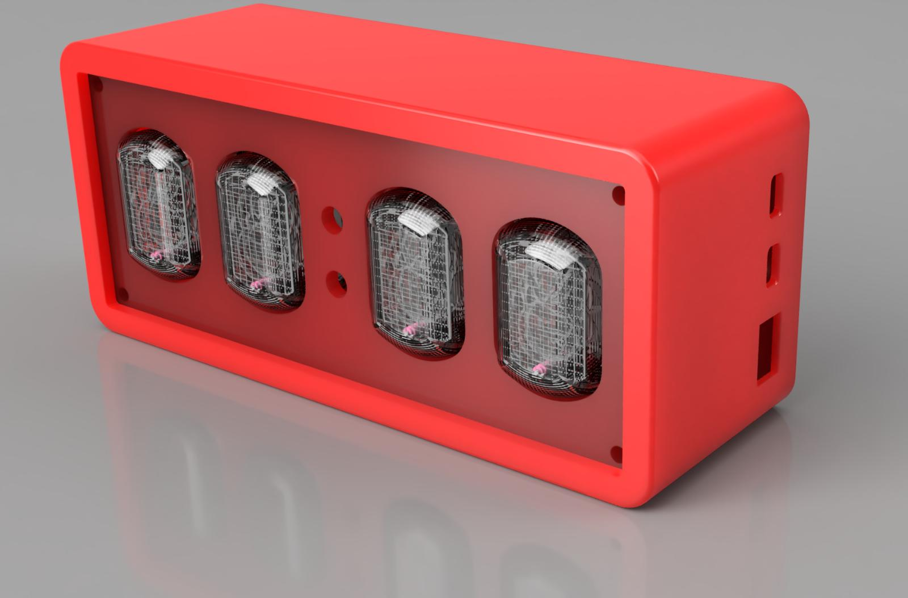
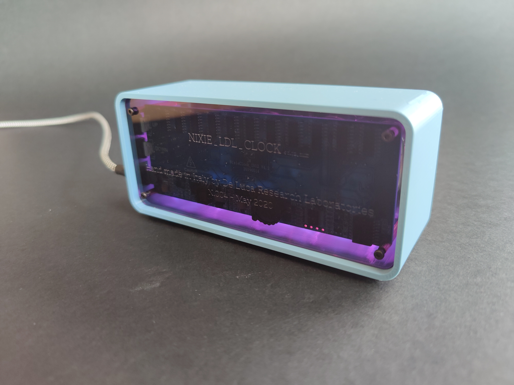
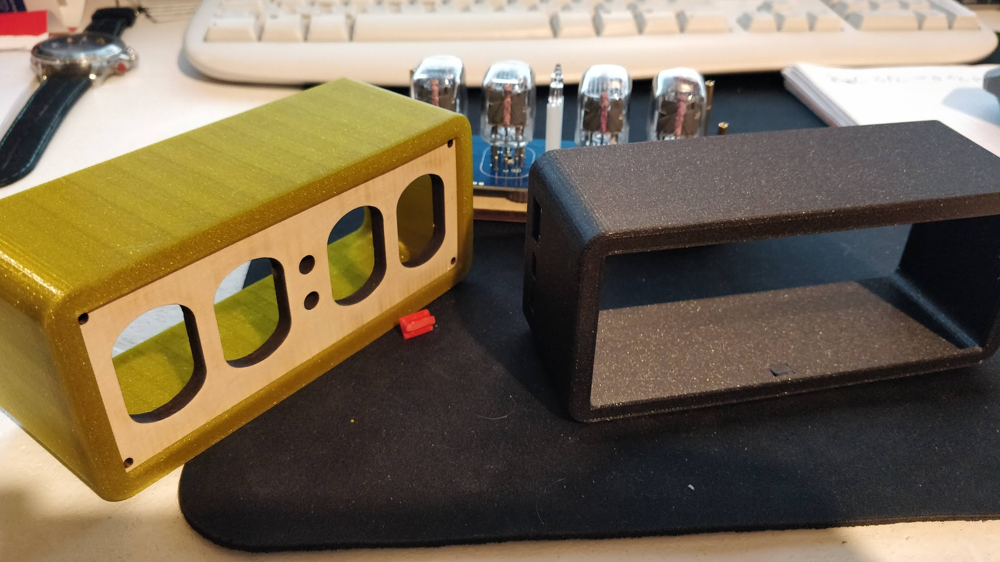
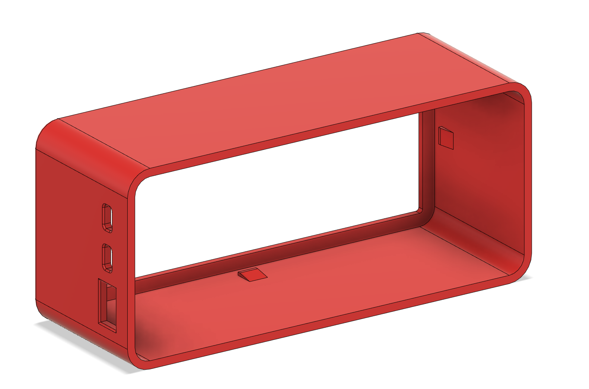
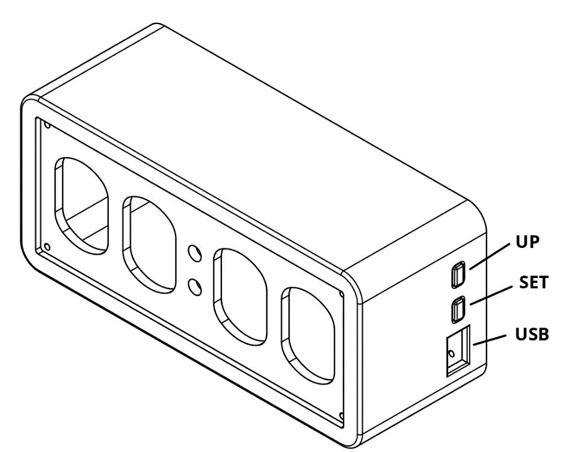
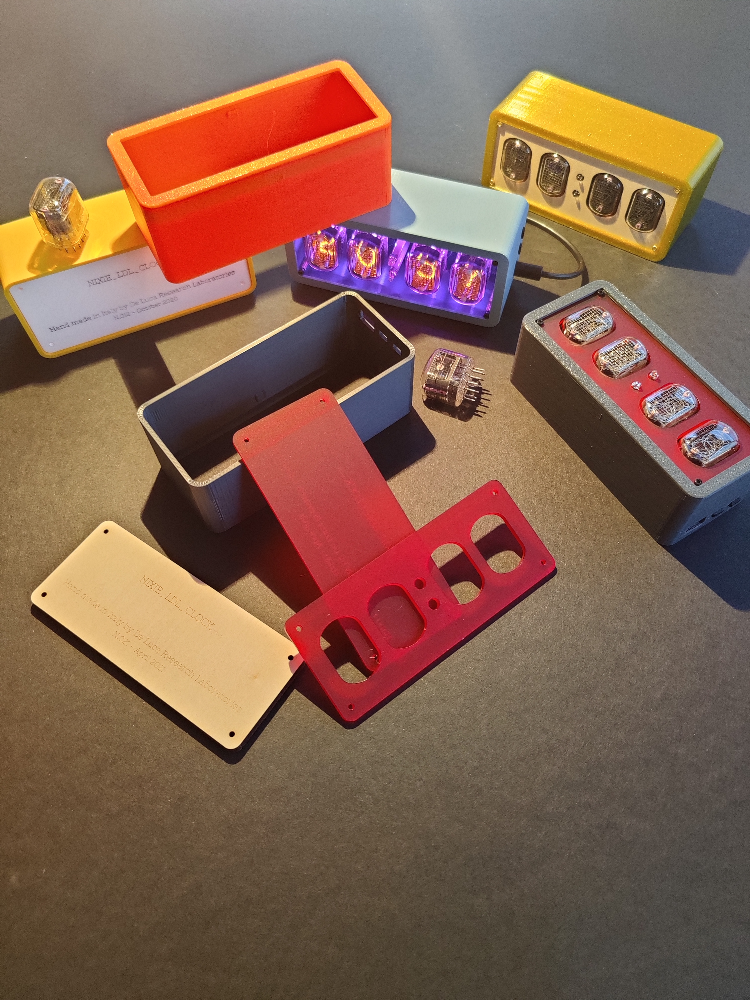

# Nixie_ldl_clock IN-12

## description

GitHub project repository:https://github.com/lorenzo-dl/NIXIE_LDL_CLOCK

Nixie tubes are a vintage type of display that uses a glass tube filled with a low-pressure mixture of Neon and other gasses like Argon.

Inside the tube there are a wire-mesh anode and multiple cathodes shaped like numbers.

Applying power to one cathode surrounds it with an orange glow discharge.

This color is very unique and difficult to recreate with modern technology like LEDs, so, even if these tubes are today quite rare and difficult to obtain, they’ve been used in several clocks.

I’ve decided to create a Nixie Clock myself because, when I’ve fist searched the internet for a design, I wasn’t able to find a model that was easy to print and that looks good at the same time.

This is the v2 version, that has quite changed from the first prototype, thanks to lots of tips that I’ve received from my fellow makers at FabLab Belluno and from visitors of Maker Faire Trieste 2020 and Maker Island Olbia 2020.

The design consists of a 3d printed body, two 3d printed buttons and two laser cutted panels (that can also be 3d printed). 

The electronics is the popular pcb “NicieClock_IN12 V4.2” that can be purchasd on Ebay or AliExpress for around 20€. 
https://www.ebay.com/itm/233675957492
https://it.aliexpress.com/item/4000030305104.html (I’ve bought mine from this link)

It uses four IN-12 soviet nixies, that can be found on Ebay as well.
https://www.ebay.com/sch/nixie+in-12
https://www.ebay.com/itm/274569259229

All the screws and standoffs that are needed for this project are included in the PCB kit, but if you don’t like the look of the gray screws is possible to buy any kind of M2x8mm screw (I’ve tried for example black steel ones and titanium gold ones).

| Front | Back |
|--------|--------|
| | |

Find additional info about each design in:
* <a href="https://github.com/lorenzo-dl/NIXIE_LDL_CLOCK/tree/main/3d">3D parts</a>
* <a href="https://github.com/lorenzo-dl/NIXIE_LDL_CLOCK/tree/main/laser">Laser cutted parts</a>
* <a href="https://github.com/lorenzo-dl/NIXIE_LDL_CLOCK/tree/main/images">Images</a>

# Print Settings

I’ve decided to print all of the parts of this clock out of Prusament PETG.

First of all because I want the increased temperature resistance from PLA.
The choice of Prusament is because of is consistency between batches and different colors. 

I used Prusa Slicer and an original Prusa MK3S with the powder coated bed for the 3d printed parts.

All the stls are in the right orientation.

The front and back plate is intended to be laser cutted on 3mm acrylic (files included), but can be 3d printed as well, so I’ve included a stl file for them.
Prints the following parts:

- 1x nixieLDL_v2_Body_3mm: Prusament PETG, Preset 0.2mm SPEED, no supports, 3 wall
- 1x nixieLDL_v2_Buttons: Prusament PETG, Preset 0.2mm SPEED, supports on build plate only
- 1x nixieLDL_v2_BackPanel_3mm (if not laser cutted): Prusament PETG, Preset 0.3mm DRAFT, no supports
- 1x nixieLDL_v2_FrontPanel_3mm (if not laser cutted): Prusament PETG, Preset 0.3mm DRAFT, no supports

# Part List
- Printed parts
- Laser cutted parts (not necessary)
- 1x PCB kit (with the included screw and stand-offs).
- 4x IN-12 Nixie tubes
- …x Haribo bears (not necessary but highly recommended)

# Assembly instruction 

With a soldering iron solder the tube socket pins and the digit separator bulbs (included in the kit).

Insert the front panel on the body and make sure it is well secured by the clips on the printed part. (Image below)

Now get the back panel, insert in every 4 hole a screw and secure them in the back with the smaller type of stand-offs that are included in the kit, insert the pcb now and pay attention that the buttons and the usb port are on the right side.

Connect now the bigger stand-offs and on top the medium ones like in the photo below.

Place now the buttons in the holes presents in the main body, and snap in place the front plate.

Insert very carefully the previously assembled block with the pcb, the back plate and all the stand-offs in the main body, the usb/button side need to be in the right orientation.

Secure now the whole assembly with 4 screws on the front plate and you’re done.

Happy printing and enjoy your new clock.

### licensing and contacts
Thank you for reading and your interest, if you want more details feel free to visit the project <a href="https://github.com/lorenzo-dl/Pixie_6digit_clock">GitHub page</a> or contact me on Instagram <a href="https://www.instagram.com/delucalabs/">@delucalabs</a>.

This design is free for personal use, please don’t sell an exact copy of this.

I sell some assembled clocks, if you want to know more contact me on Instagram.

This design is licensed under a :<a href="https://creativecommons.org/licenses/by-nc/4.0/">Creative Commons (4.0 International License) Attribution-NonCommercial</a>.

If you find this design useful, please consider a donation via <a href="https://paypal.me/LDL11">paypal.me/LDL11</a> for supporting new designs and further development. Thanks.

